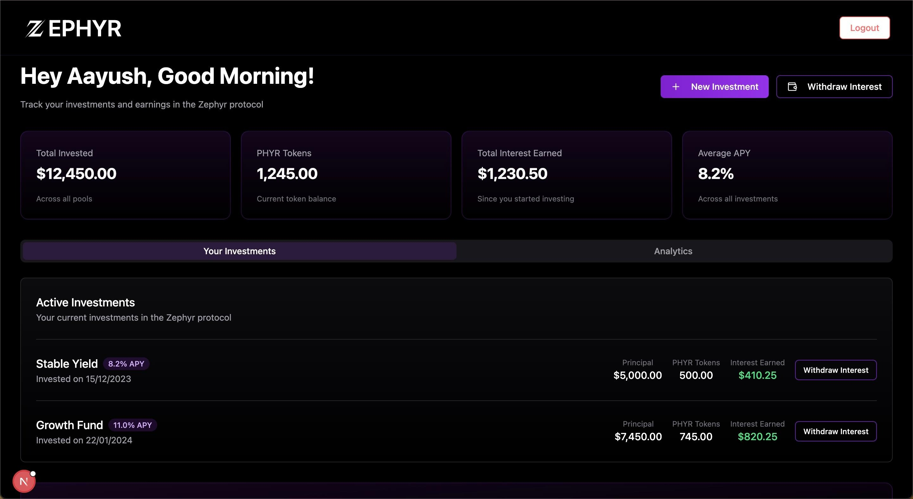
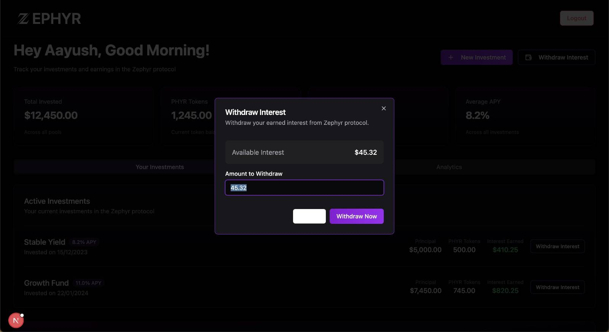
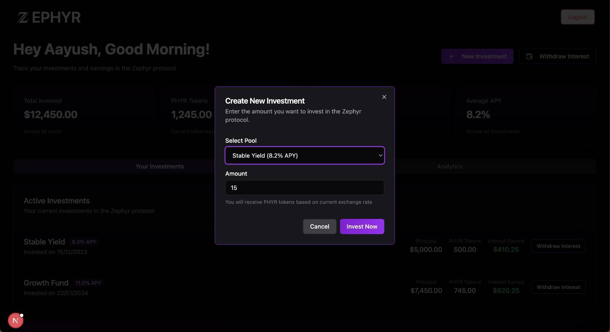

# Zephyr Protocol Lender Dashboard
<div>
  
</div>


## Overview

The Zephyr Protocol Lender Dashboard is a web application built with Next.js that provides lenders with a comprehensive interface to manage their lending activities on the Zephyr Protocol. This dashboard offers real-time analytics, portfolio management, and transaction capabilities in an intuitive user interface.

## Features

- **Real-time Analytics**: Monitor market trends, lending rates, and protocol performance metrics
- **Portfolio Management**: Track your lending positions, earnings, and risk exposure
- **Transaction Interface**: Deposit, withdraw, and adjust lending parameters seamlessly
- **Position History**: View historical performance of lending positions with detailed charts
- **Risk Assessment Tools**: Evaluate potential risks and rewards for different lending strategies
- **Notifications**: Stay updated with important alerts about your positions and protocol updates
- **User Profile Management**: Customize your experience and security settings

## Screenshots

### Dashboard Overview
<div align="center">
  
</div>

### Withdraw Interface
<div align="center">
  
</div>

### Investment Interface
<div align="center">
  
</div>

## Technology Stack

- **Frontend**: Next.js, React, TypeScript
- **Styling**: Tailwind CSS, Shadcn UI
- **State Management**: Redux Toolkit
- **Data Visualization**: Recharts
- **Authentication**: Appwrite
- **API Integration**: Zephyr Protocol API
- **Web3 Integration**: ethers.js, Web3Modal

## Getting Started

### Prerequisites

- Node.js (v18 or higher)
- npm or yarn
- MetaMask wallet

### Installation

1. Clone the repository:
   ```bash
   git clone https://github.com/your-organization/zephyr-lender-dashboard.git
   cd zephyr-lender-dashboard
   ```

2. Install dependencies:
   ```bash
   npm install
   # or
   yarn install
   ```

3. Start the development server:
   ```bash
   npm run dev
   # or
   yarn dev
   ```

4. Open [http://localhost:3000](http://localhost:3000) in your browser to see the dashboard.

## Project Structure

```
zephyr-lender-dashboard/
├── components/            # React components
│   ├── common/            # Shared UI components
│   ├── dashboard/         # Dashboard-specific components
│   ├── layout/            # Layout components
│   └── transactions/      # Transaction-related components
├── pages/                 # Next.js pages
│   ├── api/               # API routes
│   ├── dashboard/         # Dashboard pages
│   ├── profile/           # User profile pages
│   └── transactions/      # Transaction pages
├── public/                # Static assets
├── styles/                # Global styles
├── lib/                   # Utility functions and hooks
│   ├── api/               # API client functions
│   ├── blockchain/        # Blockchain interaction utilities
│   └── hooks/             # Custom React hooks
├── store/                 # Redux store configuration
├── types/                 # TypeScript type definitions
└── next.config.js         # Next.js configuration
```

## Deployment

### Production Build

1. Create a production build:
   ```bash
   npm run build
   # or
   yarn build
   ```

2. Start the production server:
   ```bash
   npm run start
   # or
   yarn start
   ```

### Deployment Platforms

This dashboard can be deployed on:
- Vercel (recommended for Next.js applications)
- Netlify
- AWS Amplify
- Docker container on any cloud provider

## Configuration

### Environment Variables

| Variable | Description | Required |
|----------|-------------|----------|
| `NEXT_PUBLIC_ZEPHYR_API_URL` | Zephyr Protocol API URL | Yes |
| `NEXT_PUBLIC_CHAIN_ID` | Blockchain network ID | Yes |
| `NEXTAUTH_SECRET` | Secret for NextAuth.js | Yes |
| `NEXTAUTH_URL` | URL for NextAuth.js | Yes |
| `NEXT_PUBLIC_INFURA_ID` | Infura project ID | No |

## Contributing

1. Fork the repository
2. Create a feature branch: `git checkout -b feature-name`
3. Commit your changes: `git commit -m 'Add some feature'`
4. Push to the branch: `git push origin feature-name`
5. Open a pull request

## Security

The Zephyr Protocol Lender Dashboard incorporates several security measures:

- Secure wallet connections
- Data encryption for sensitive information
- Regular security audits
- Rate limiting to prevent abuse